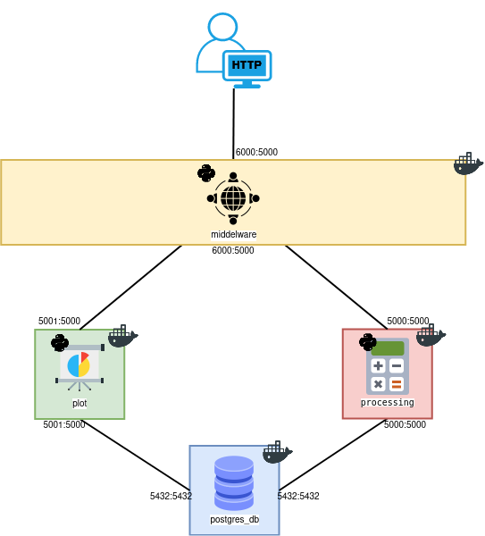
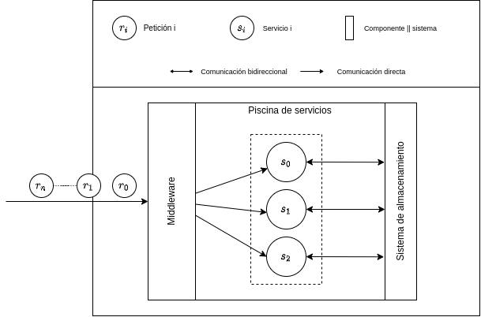

# Demo Ciencias de Datos

Demo enfocado para ser utilizado en forma de usuario y conocer la comunicación entre los diferentes contenedores.

El demo consiste en 4 contenedores con las siguientes características:

- Container 1: (Postgres) Una base de datos.
- Container 2: (Processing) Contenedor enfocado a realizar operaciones básicas.
- Container 3: (Plot) Contenedor enfocado a crear boxplots sobre los datos generados.
- Container 4: (Middelware) Contenedor encargado de interactuar entre el usuario y los servicios.

El diseño del demo queda de la siguiente manera:

# Requisitos

Para poder utilizar este demo es necesario tener instalado las siguientes herramientas:

- Docker
- Python 3

Descargar las imágenes de los contenedores:

- docker pull postgres:latest
- docker pull jmorin98/processing
- docker pull jmorin98/plot
- docker pull nachocode/demo-middleware

# Docker RUN

#### Red Docker

Antes de generar los contenedores sobre las imagenes es necesario crear una red de docker, se genera con el siguiente comando:

Comando terminal:

`docker network create [NETWORK_NAME]`

Ejemplo:

`docker network create  --driver=bridge my-net`

Para poder ejcutar los contenedores se necesita el siguiente comando:

#### Container 1 - Postgres

Contenedor encargado de almacenar los datos generados por los usuarios (**NOTA:** se requiere ejecutar este contenedor primero que todos debido a que los demas dependen de la base de datos).

Nombre de imagen:

- postgres:latest

Variables de entorno:

- POSTGRES_USER
- POSTGRES_DB
- POSTGRES_PASSWORD

Comando terminal:

`docker run --name [CONTAINER_NAME] -e POSTGRES_USER=[POSTGRES_USER] -e POSTGRES_DB=[POSTGRES_BD] -e POSTGRES_PASSWORD=[POSTGRES_PASSWORD] -p [LOCAL_PORT]:5432 -v [LOCAL_VOLUMEN]:/var/lib/postgresql/data -v [LOCAL_VOLUMEN_INIT_SQL]:/docker-entrypoint-initdb.d/initsql --hostname [CONTAINER_NAME] --network=[NETWORK_NAME] postgres:latest`

Ejemplo:

`docker run --name postgres_db -e POSTGRES_USER=postgres -e POSTGRES_DB=demo -e POSTGRES_PASSWORD=postgres -p 5432:5432 -v /test/demo_ciencias/data:/var/lib/postgresql/data -v /home/usuario/DEMO_CIENCIAS_DATOS/DB_demo/init.sql:/docker-entrypoint-initdb.d/init.sql --hostname postgres_db --network=demo_net -d postgres:latest`

La tabla tiene el nombre de ciencias y se configura dentro del archivo `init.sql` y se conforma de la siguiente manera:

`CREATE TABLE ciencias (x floatNOTNULL, y floatNOTNULL, z_SUM float, z_SUBSTRACT float, z_PRODUCT float, z_DIVIDE float )`

#### Container 2 - Processing

Contenedor encargado de generar las operaciones básicas sobre los datos almacenadoS dentro de la base de datos (*Container 1*) y retornar al usuario los valores obtenidos.

Nombre de imagen:

- jmorin98/processing:latest

Variables de entorno:

- POSTGRES_USER
- POSTGRES_DB
- POSTGRES_PASSWORD
- POSTGRES_PORT
- POSTGRES_HOST

Comando terminal:

`docker run --name [CONTAINER_NAME] -e POSTGRES_USER=[POSTGRES_USER] -e POSTGRES_DB=[POSTGRES_DB] -e POSTGRES_PASSWORD=[POSTGRES_PASSWORD] -e POSTGRES_PORT=[POSTGRES_PORT] -e POSTGRES_HOST=[POSTGRES_HOST] -p [LOCAL_PORT]:5000 --hostname [CONTAINER_NAME] --network=[NETWORK_NAME] jmorin98/processing:latest`

Ejemplo:

`docker run --name processing -e POSTGRES_USER=postgres -e POSTGRES_DB=demo -e POSTGRES_PASSWORD=postgres -e POSTGRES_PORT=5432 -e POSTGRES_HOST=postgres_db -p 5000:5000 --hostname proccessing --network=demo_net -d jmorin98/processing:latest`

API REST

Rutas que conforman este contenedor para ser utilizado:

| RUTA                           | MÉTODO | DESCRIPCIÓN                                              |
| ------------------------------ | ------- | --------------------------------------------------------- |
| /api/v1/processing/xy          | POST    | Almacena los valores de*X e Y* enviados por el usuario. |
| /api/v1/processing/xy          | GET     | Retorna los valores de*X e Y* de la base de datos.      |
| /api/v1/processing/z_sum       | POST    | Ejecuta y almacena la suma entre*X e Y*.                |
| /api/v1/processing/z_sum       | GET     | Retorna los valores de la suma.                           |
| /api/v1/processing/z_substract | POST    | Ejecuta y almacena la resta entre*X e Y.*               |
| /api/v1/processing/z_substract | GET     | Retorna los valores de la resta.                          |
| /api/v1/processing/z_product   | POST    | Ejecuta y almacena el producto entre*X e Y.*            |
| /api/v1/processing/z_product   | GET     | Retorna los valores del producto.                         |
| /api/v1/processing/z_divide    | POST    | Ejecuta y almacena la división entre*X e Y.*           |
| /api/v1/processing/z_divide    | GET     | Retorna los valores de la división.                      |
| /api/v1/processing/z_operator  | POST    | Ejecuta y almacena todas las operaciones básicas         |
| /api/v1/processing/z_operator  | GET     | Retorna los valores de las operaciones básicas.          |

#### Container 3 - Plot

Contenedor encargado de generar y retornar la imagen de un boxplot correspondiente a cada columna de la base de datos.

Nombre de imagen:

- jmorin98/plot:latest

Variables de entorno:

- POSTGRES_USER
- POSTGRES_DB
- POSTGRES_PASSWORD
- POSTGRES_PORT
- POSTGRES_HOST

Comando terminal:

`docker run --name [CONTAINER_NAME] -e POSTGRES_USER=[POSTGRES_USER] -e POSTGRES_DB=[POSTGRES_DB] -e POSTGRES_PASSWORD=[POSTGRES_PASSWORD] -e POSTGRES_PORT=[POSTGRES_PORT] -e POSTGRES_HOST=[POSTGRES_HOST] -e SINK_PATH=[SINK_PATH] -v [LOCAL_VOLUME]:[DOCKER_VOLUME] -p [LOCAL_PORT]:5000 --hostname [CONTAINER_NAME] --network=[NETWORK_NAME] jmorin98/plot:latest`

Ejemplo:

`docker run --name plot -e POSTGRES_USER=postgres -e POSTGRES_DB=demo -e POSTGRES_PASSWORD=postgres -e POSTGRES_PORT=5432 -e POSTGRES_HOST=postgres_db -e SINK_PATH=/app/plots -v /test/demo_ciencias/plots:/app/plots -p 5001:5000 --hostname plot --network=demo_net -d jmorin98/plot:latest`

API REST

Rutas que conforman este contenedor para ser utilizado:

| RUTA                     | MÉTODO | DESCRIPCIÓN                                                |
| ------------------------ | ------- | ----------------------------------------------------------- |
| /api/v1/plot/xy          | GET     | Retorna boxplot de*X e Y* de la base de datos.            |
| /api/v1/plot/z_sum       | GET     | Retorna boxplot de los valores de la suma.                  |
| /api/v1/plot/z_substract | GET     | Retorna boxplot de los valores de la resta.                 |
| /api/v1/plot/z_product   | GET     | Retorna boxplot de los valores del producto.                |
| /api/v1/plot/z_divide    | GET     | Retorna boxplot de los valores de la división.             |
| /api/v1/plot/z_operator  | GET     | Retorna boxplot de los valores de las operaciones básicas. |

#### Container 4 - Middelware

Componente de software que permite la interacción con diferentes servicios, permitiendo así gestionar la comunicación entre un usuario y una piscina de servicios.

Nombre de imagen:

- nachocode/demo-middleware:latest

Variables de entorno:

- MODE: Recibe los valores LOCAL || DISTRIBUTED. Cuando recibe LOCAL, se comunica usando la red local. Cuando recibe DISTRIBUTED se comunica empleando una red virtual de docker. 
- NODE_PORT: Puerto del nodo en el HOST.
- NODE_HOST: Recibe el valor de 0.0.0.0 para que permita recibir peticiones de cualquier dirección IP.
- DEBUG: Recibe True o False, respectivamente activa el modo prueba o desactiva el modo de prueba. 

Comando terminal:

`docker run --name [CONTAINER_NAME] -e MODE=[MODE] -e NODE_PORT=[NODE_PORT] -e NODE_HOST=[NODE_HOST] -e DEBUG=[DEBUG] -p [LOCAL_PORT]:[DOCKER_PORT] --hostname [CONTAINER_NAME] --network=[NETWORK_NAME] nachocode/demon-middleware`

Ejemplo:
`docker run --name middleware  -e MODE=DISTRIBUTED -e NODE_PORT=6666 -e NODE_HOST="0.0.0.0" -e DEBUG="False" -p 6666:6666 --hostname middleware --network=my-net -d nachocode/demo-middleware`

API REST:

Rutas que conforman este contenedor para ser utilizado:

| RUTA                     | MÉTODO | DESCRIPCIÓN                                                |
| ------------------------ | ------- | ----------------------------------------------------------- |
| /api/v1/processing/[path]          | POST / GET     | Redirige las peticiones al servicio de procesamiento|
| /api/v1/plot/[path]       | POST / GET     | Redirige las peticiones al servicio de visualizaciòn |

#### Comandos básicos
Esta sección describe un conjunto de comandos básicos de docker: 

| COMANDO                                                 | DESCRIPCIÓN                                                                                                         |
| ------------------------------------------              | ------------------------------------------------------------------------------------------------------------------- |
| docker pull [DOCKER_IMAGE]                              | Descarga imágenes de contenedores que se encuentran en la plataforma de DockerHub                                   |
| docker run [OPTIONS] [DOCKER_IMAGE]                     | Despliega un contenedor virtual con las opciones declaradas y basado en una imagen establecida.                     |
| docker rm [CONTAINER_NAME || CONTAINER_ID]              | Elimina un contenedor virtual especificando su nombre o identificador único.                                        |
| docker ps [?OPTIONS]                                    | Permite visualizar información básica de los contenedores virtuales.                                                |
| docker logs [?OPTIONS] [CONTAINER_NAME] | Recupera los mensajes que se imprimen en consola que son redirigidos al descriptor del archivo conocido como STDOUT.|

Descripción de la sintaxis utilizada en la tabla que muestra los comandos básicos:
- DOCKER_IMAGE: nombre de la imagen de contenedor (e.g jmorin98/processing || prostgres:latest ).
- OPTIONS: Lista de opciones que recibe el comando (e.g -p 6666:6666  || -f ).
- CONTAINER_NAME: Nombre del contenedor.
- CONTAINER_ID: Identificador unico del contenedor.

El signo de interrogación hace referencia a que los parámetros son opcionales (e.g [?OPTIONS]).
