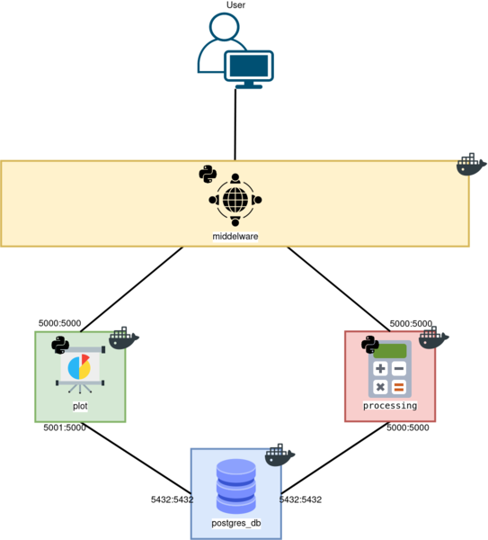

# Demo Ciencias de Datos

Demo enfocado para ser utilizado en forma de usuario y conocer la comunicación entre los diferentes contenedores.

El demo consiste en 4 contenedores con las siguientes características:

- Container 1: (Postgres) Una base de datos.
- Container 2: (Processing) Contenedor enfocado a realizar operaciones básicas.
- Container 3: (Plot) Contenedor enfocado a crear boxplots sobre los datos generados.
- Container 4: (Middelware) Contenedor encargado de interactuar entre el usuario y los servicios.

El diseño del demo queda de la siguiente manera:

# Requisitos

Para poder utilizar este demo es necesario tener instalado las siguientes herramientas:

- Docker
- Python 3

# Docker RUN

#### Red Docker

Antes de generar los contenedores sobre las imagenes es necesario crear una red de docker, se genera con el siguiente comando:

Comando terminal:

`docker network create [NAME_NETWORK]`

Ejemplo:

`docker network create demo_net`

Para poder ejcutar los contenedores se necesita el siguiente comando:

#### Container 1 - Postgres

Contenedor encargado de almacenar los datos generados por los usuarios (**NOTA:** se requiere ejecutar este contenedor primero que todos debido a que los demas dependen de la base de datos).

Nombre del contenedor:

- postgres:latest

Variables de entrono requeridas:

- POSTGRES_USER
- POSTGRES_DB
- POSTGRES_PASSWORD

Comando terminal:

`docker run --name [NAME_CONTAINER] -e POSTGRES_USER=[NAME_USER] -e POSTGRES_DB=[NAME_BD] -e POSTGRES_PASSWORD=[PASDWORD] -p [LOCAL_PORT]:5432 -v [LOCAL_VOLUMEN]:/var/lib/postgresql/data -v [LOCAL_VOLUMEN_INIT_SQL]:/docker-entrypoint-initdb.d/initsql --hostname [NAME_CONTAINER] --network=[NAME_NETWORK] postgres:latest`

Ejemplo:

`docker run --name postgres_db -e POSTGRES_USER=posgres -e POSTGRES_DB=demo -e POSTGRES_PASSWORD=postgres -p 5432:5432 -v /test/demo_ciencias/data:/var/lib/postgresql/data -v /home/usuario/DEMO_CIENCIAS_DATOS/DB_demo/init.sql:/docker-entrypoint-initdb.d/init.sql --hostname postgres_db --network=demo_net postgres:latest`

La tabla tiene el nombre de ciencias y se configura dentro del archivo `init.sql` y se conforma de la sigueinte manera:

`CREATE TABLE ciencias (x floatNOTNULL, y floatNOTNULL, z_SUM float, z_SUBSTRACT float, z_PRODUCT float, z_DIVIDE float )`

#### Container 2 - Processing

Contenedor encargado de generar las operaciones básicas sobre los datos almacenadoS dentro de la base de datos (*Container 1*) y retornar al usuario los valores obtenidos.

Nombre del contenedor:

- jmorin98/processing:latest

Variables de entrono requeridas:

- POSTGRES_USER
- POSTGRES_DB
- POSTGRES_PASSWORD
- POSTGRES_PORT
- POSTGRES_HOST

Comando terminal:

`docker run --name [NAME_CONTAINER] -e POSTGRES_USER=[USER_CONTAINER_POSTGRES] -e POSTGRES_DB=[BD_CONTAINER_POSTGRES] -e POSTGRES_PASSWORD=[PASSWORD_CONTAINER_POSTGRES] -e POSTGRES_PORT=[PORT_CONTAINER_POSTGRES] -e POSTGRES_HOST=[NAME_CONTAINER_POSTGRES] -p [LOCAL_PORT]:5000 --hostname [NAME_CONTAINER] --network=[NAME_NETWORK] jmorin98/processing:latest`

Ejemplo:

`docker run --name processing -e POSTGRES_USER=postgres -e POSTGRES_DB=demo -e POSTGRES_PASSWORD=postgres -e POSTGRES_PORT=5432 -e POSTGRES_HOST=postgres_db -p 5000:5000 --hostname proccessing --network=demo_net jmorin98/processing:latest`

API REST

Rutas que conforman este contenedor para ser utilizado:

| RUTA                           | MÉTODO | DESCRIPCIÓN                                              |
| ------------------------------ | ------- | --------------------------------------------------------- |
| /api/v1/processing/xy          | POST    | Almacena los valores de*X e Y* enviados por el usuario. |
| /api/v1/processing/xy          | GET     | Retorna los valores de*X e Y* de la base de datos.      |
| /api/v1/processing/z_sum       | POST    | Ejecuta y almacena la suma entre*X e Y*.                |
| /api/v1/processing/z_sum       | GET     | Retorna los valores de la suma.                           |
| /api/v1/processing/z_substract | POST    | Ejecuta y almacena la resta entre*X e Y.*               |
| /api/v1/processing/z_substract | GET     | Retorna los valores de la resta.                          |
| /api/v1/processing/z_product   | POST    | Ejecuta y almacena el producto entre*X e Y.*            |
| /api/v1/processing/z_product   | GET     | Retorna los valores del producto.                         |
| /api/v1/processing/z_divide    | POST    | Ejecuta y almacena la división entre*X e Y.*           |
| /api/v1/processing/z_divide    | GET     | Retorna los valores de la división.                      |
| /api/v1/processing/z_operator  | POST    | Ejecuta y almacena todas las operaciones básicas         |
| /api/v1/processing/z_operator  | GET     | Retorna los valores de las operaciones básicas.          |

#### Container 3 - Plot

Contenedor encargado de generar y retornar la imagen de un boxplot correspondiente a cada columna de la base de datos.

Nombre del contenedor:

- jmorin98/plot:latest

Variables de entrono requeridas:

- POSTGRES_USER
- POSTGRES_DB
- POSTGRES_PASSWORD
- POSTGRES_PORT
- POSTGRES_HOST

Comando terminal:

`docker run --name [NAME_CONTAINER] -e POSTGRES_USER=[USER_CONTAINER_POSTGRES] -e POSTGRES_DB=[BD_CONTAINER_POSTGRES] -e POSTGRES_PASSWORD=[PASSWORD_CONTAINER_POSTGRES] -e POSTGRES_PORT=[PORT_CONTAINER_POSTGRES] -e POSTGRES_HOST=[NAME_CONTAINER_POSTGRES] -e SINK_PATH=[PATH_CONTAINER] -v [LOCAL_VOLUMEN]:[PATH_CONTAINER] -p [LOCAL_PORT]:5000 --hostname [NAME_CONTAINER] --network=[NAME_NETWORK] jmorin98/plot:latest`

Ejemplo:

`docker run --name plot -e POSTGRES_USER=postgres -e POSTGRES_DB=demo -e POSTGRES_PASSWORD=postgres -e POSTGRES_PORT=5432 -e POSTGRES_HOST=postgres_db -e SINK_PATH=/app/plots -v /test/demo_ciencias/plots:/app/plots -p 5001:5000 --hostname plot --network=demo_net jmorin98/plot:latest`

API REST

Rutas que conforman este contenedor para ser utilizado:

| RUTA                     | MÉTODO | DESCRIPCIÓN                                                |
| ------------------------ | ------- | ----------------------------------------------------------- |
| /api/v1/plot/xy          | GET     | Retorna boxplot de*X e Y* de la base de datos.            |
| /api/v1/plot/z_sum       | GET     | Retorna boxplot de los valores de la suma.                  |
| /api/v1/plot/z_substract | GET     | Retorna boxplot de los valores de la resta.                 |
| /api/v1/plot/z_product   | GET     | Retorna boxplot de los valores del producto.                |
| /api/v1/plot/z_divide    | GET     | Retorna boxplot de los valores de la división.             |
| /api/v1/plot/z_operator  | GET     | Retorna boxplot de los valores de las operaciones básicas. |

#### Container 4 - Middelware
